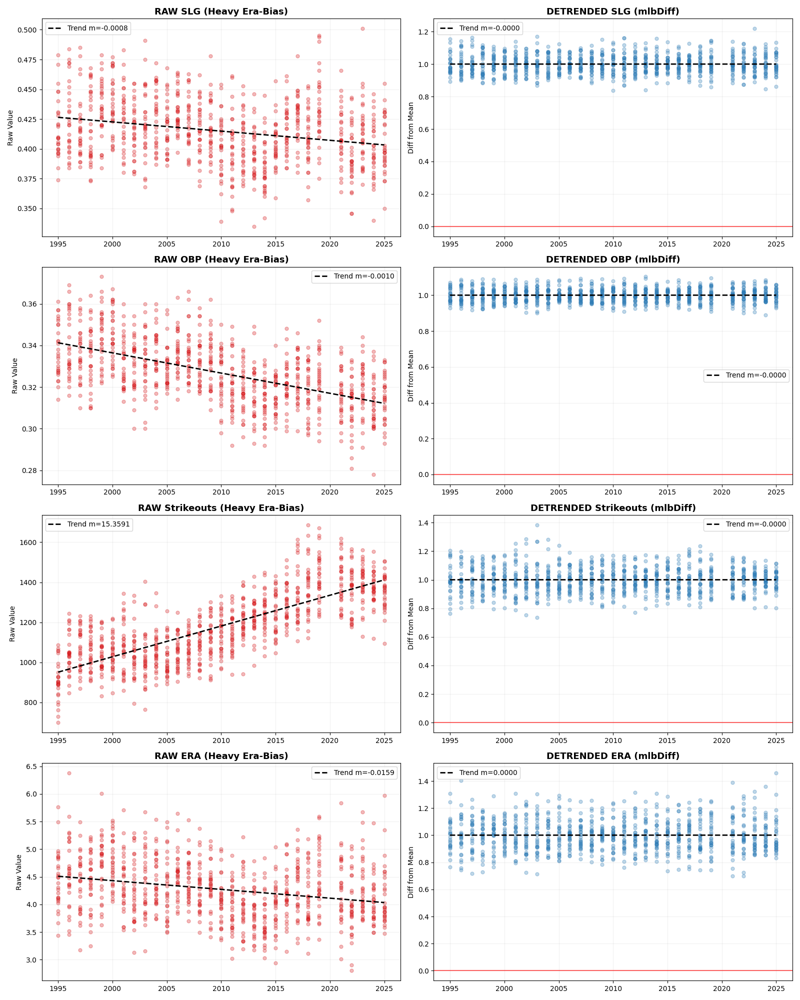
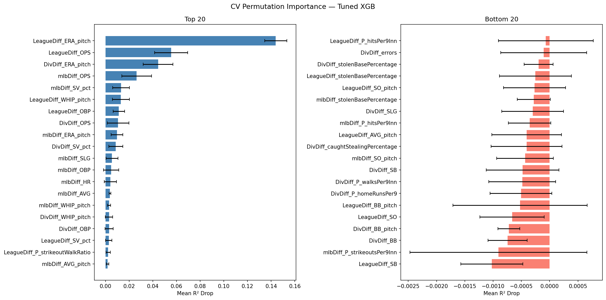
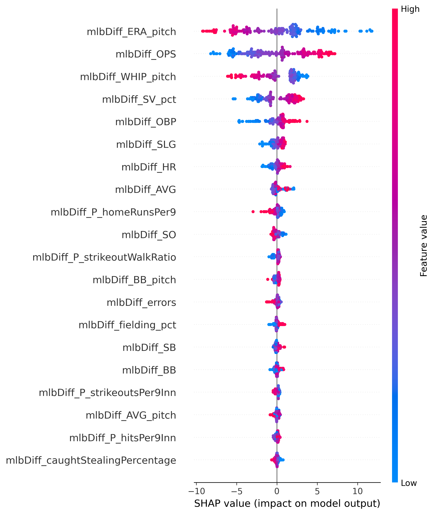

# MLB Division Standings Prediction — 2026

> Predicting final division standings for all 6 MLB divisions using preseason projected team statistics and a weighted XGBoost ensemble.

---

## Table of Contents
- [Overview](#overview)
- [Results — 2026 Predictions](#results--2026-predictions)
- [Methodology](#methodology)
  - [Data](#data)
  - [EDA & Temporal Trends](#eda--temporal-trends)
  - [Preprocessing & Feature Engineering](#preprocessing--feature-engineering)
  - [Model Architecture](#model-architecture)
  - [Model Selection](#model-selection)
- [Performance](#performance)
- [Project Structure](#project-structure)

---

## Overview

This project builds a machine learning pipeline to predict MLB division standings before the season begins. Given only preseason-projected team statistics — built bottom-up from the career stats of each team's current 2026 roster — the model predicts final win totals and division rankings for all 30 teams across 6 divisions.

**Primary evaluation metric:** Kendall's τ — measures pairwise ranking accuracy across all division-year combinations, making it more meaningful than raw win prediction error for a standings problem.

---

## Results — 2026 Predictions

### AL East
| Rank | Team | Projected Wins |
|:----:|------|:--------------:|
| 1 | NYY | 91 |
| 2 | BOS | 89 |
| 3 | BAL | 84 |
| 4 | TOR | 82 |
| 5 | TBR | 75 |

### AL Central
| Rank | Team | Projected Wins |
|:----:|------|:--------------:|
| 1 | DET | 90 |
| 2 | KCR | 81 |
| 3 | CLE | 80 |
| 4 | MIN | 73 |
| 5 | CHW | 67 |

### AL West
| Rank | Team | Projected Wins |
|:----:|------|:--------------:|
| 1 | SEA | 91 |
| 2 | ATH | 82 |
| 3 | HOU | 81 |
| 4 | TEX | 80 |
| 5 | LAA | 71 |

### NL East
| Rank | Team | Projected Wins |
|:----:|------|:--------------:|
| 1 | NYM | 93 |
| 2 | PHI | 92 |
| 3 | ATL | 92 |
| 4 | MIA | 76 |
| 5 | WSN | 61 |

### NL Central
| Rank | Team | Projected Wins |
|:----:|------|:--------------:|
| 1 | CHC | 89 |
| 2 | PIT | 85 |
| 3 | MIL | 84 |
| 4 | CIN | 79 |
| 5 | STL | 65 |

### NL West
| Rank | Team | Projected Wins |
|:----:|------|:--------------:|
| 1 | LAD | 101 |
| 2 | SDP | 90 |
| 3 | SFG | 78 |
| 4 | ARI | 77 |
| 5 | COL | 55 |

> **Total projected wins:** 2,434 &nbsp;|&nbsp; **Historical target:** 2,430 — near-perfect league-wide calibration.

### Projected Wild Card Teams
| League | Team | Projected Wins |
|--------|------|:--------------:|
| AL | BOS | 89 |
| AL | BAL | 84 |
| AL | ATH | 82 |
| NL | PHI | 92 |
| NL | ATL | 92 |
| NL | SDP | 90 |

---

## Methodology

### Data

- **Training:** 1995–2025 team-season statistics (~870 team-seasons), excluding the 2020 COVID-shortened season
- **Held-out test set:** 2019–2025 — temporally separated, never seen during model development
- **2026 inference:** Projected team statistics built bottom-up from the career stats of each team's current roster

**Data sources:**

| Source | What It Provides | Script |
|--------|-----------------|--------|
| FanGraphs | 2026 projected rosters with playing-time weights | `rosters_mlb_api.py` |
| MLB Stats API (`/api/v1/stats`) | Career hitting, pitching, and fielding stats for all rostered players | `scrape_mlb_api.py` |
| MLB Stats API (`/api/v1`) | Historical team statistics, 1995–2025 | `fetch_all_team_stats.py` |

### EDA & Temporal Trends

Before modeling, each feature was examined for year-over-year drift using Spearman correlation with calendar year. Features with strong temporal trends can teach the model "it is a recent year" rather than "this team is strong" — a form of data leakage.



Key findings:

| Feature Group | Spearman ρ | Trend |
|--------------|:-----------:|-------|
| Strikeout stats (`SO`, `K/9`, `K/BB`) | +0.91–0.93 | Sharply increasing |
| Batting average, hits allowed | −0.87–0.91 | Sharply decreasing |
| Fielding percentage | +0.938 | Increasing |
| Errors | −0.943 | Decreasing |
| `SV_pct` (1995–1998) | — | Zero variance — data placeholder |

**Actions taken:**
- All features were expressed as **team stat relative to the league/division/MLB average** for that year (ratio for continuous rate stats, difference for bounded stats), so the model learns team quality relative to their era rather than absolute values that shift over time
- `SV_pct` zero-variance era handled with an `is_pre_1999` binary flag rather than dropping the column

### Preprocessing & Feature Engineering

2026 team statistics were projected bottom-up from individual player career data:

1. **Roster construction** — Players assigned roles (starter, reliever, closer, bench) with projected playing-time weights sourced from FanGraphs preseason projections
2. **Team aggregation** — Counting stats normalized to per-game or per-inning rates, weighted by projected playing time, then scaled to a 162-game season. Closer statistics use a role-based split (**70% Closer / 30% Setup Men**) rather than playing-time weights due to the binary nature of save opportunities
3. **Mean shifting** — League-wide projected means shifted to match historical averages, correcting for systematic projection bias without distorting team-to-team spread
4. **Team code standardization** — Full franchise names (including historical variants: Florida Marlins, Montreal Expos, etc.) mapped to current 3-letter codes

Derived statistics computed from raw API data:

| Stat | Formula |
|------|---------|
| `stolenBasePercentage` | SB / (SB + CS) |
| `babip` | (H − HR) / (AB − SO − HR) |
| `P_strikeoutWalkRatio` | SO / BB |
| `P_strikeoutsPer9Inn` | (SO / IP) × 9 |
| `P_homeRunsPer9` | (HR / IP) × 9 |

### Model Architecture

Raw team statistics were transformed into **relative features** comparing each team to three reference groups:

| Prefix | Reference Group | Why It Matters |
|--------|----------------|----------------|
| `DivDiff_` | Division average | Who wins the division title |
| `LeagueDiff_` | League average | Wild card caliber |
| `mlbDiff_` | MLB-wide average | Absolute team quality |

This produced **69 relative features** across 23 base statistics covering hitting, pitching, and fielding.

**Ensemble: 4-model weighted XGBoost**

Three XGBoost models are each specialized on one reference frame, capturing a clean and conceptually distinct signal. A fourth model hedges against a known artifact in save percentage projections.

| Component | Weight | Features | Purpose |
|-----------|:------:|----------|---------|
| XGBoost (Div) | 0.27 | `DivDiff_` only | Non-linear signal vs division competitors |
| XGBoost (League) | 0.27 | `LeagueDiff_` only | Non-linear signal vs league |
| XGBoost (MLB) | 0.27 | `mlbDiff_` only | Non-linear signal vs all of baseball |
| XGBoost (no SV_pct) | 0.20 | All positive-importance features excl. `SV_pct` | Robustness against save projection artifacts |
```
Tuned hyperparameters:
  max_depth=3 | n_estimators=300 | learning_rate=0.05
  gamma=0.5   | subsample=0.8   | colsample_bytree=1.0
```

The final prediction averages all four models' win estimates, then ranks teams within each division. This mirrors how baseball itself works: teams must beat their division to win a title, but league and MLB-wide quality determines wild card eligibility.

**Cross-validated permutation importance:**



**SHAP feature importance:**



### Model Selection

Extensive experimentation covered Ridge regression, linear models, and mixed ensembles. A Ridge + XGBoost ensemble achieved a higher test τ of **0.8426** but was ultimately rejected for 2026 inference:

- Multicollinearity caused counterintuitive coefficient signs — Ridge predicted the Angels to win the AL West despite having the worst pitching and hitting in their division
- Ridge's global coefficients amplify projection artifacts with no ceiling; XGBoost's tree structure naturally caps any single feature's influence
- The 2026 `SV_pct` distribution differs structurally from historical data due to projection methodology differences

SHAP values confirm that all feature relationships in the selected ensemble are directionally sensible.

---

## Performance

| Metric | Value |
|--------|:-----:|
| Test Kendall's τ | **0.8146** |
| Test R² (win prediction) | **0.8913** |
| Cross-validation τ | **0.8138** |

Train/test split is **temporal** — the model is trained on 1995–2018 and evaluated on 2019–2025, which is the realistic inference setting (predicting unseen future seasons from past data only).

---

## Project Structure
```
.
├── notebooks/
│   ├── Preprocessing.ipynb        # Roster construction, stat projection, mean shifting
│   ├── EDA.ipynb                  # Temporal trend analysis, zero-variance checks
│   └── Modeling.ipynb             # Feature engineering, model training, evaluation
├── scripts/
│   ├── rosters_mlb_api.py         # Pull 2026 projected rosters and playing-time weights from FanGraphs
│   ├── scrape_mlb_api.py          # Pull career stats from MLB Stats API (/api/v1/stats)
│   ├── fetch_all_team_stats.py    # Fetch historical team statistics (/api/v1)
│   └── fetch_team_fielding.py     # Fetch historical fielding data
├── data/
│   ├── CareerHittingStatsAlltime.csv
│   ├── CareerPitchingStatsAlltime.csv
│   ├── CareerFieldingStatsAlltime.csv
│   ├── PlayerTeamsAll_2026.csv
│   ├── Processed_2026_Team_Data.csv
│   └── Processed_Historical_Team_Wins_Data.csv
├── images/
│   ├── correlation_comparison_trend.png
│   ├── cv_perm_imp_tuned_xgb.png
│   └── shap_mlb.png
└── requirements.txt
```

---

## Setup
```bash
git clone https://github.com/jprich1984/Forecasting_MLB_2026.git
cd Predicting2026_MLB
pip install -r requirements.txt
```
The Generated CSV files are provided in this repository so there is no need to run the api scripts
Open the notebooks in order: `Preprocessing.ipynb` → `EDA.ipynb` → `Modeling.ipynb`.
